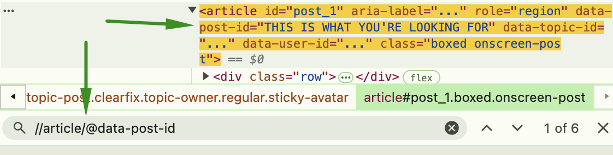
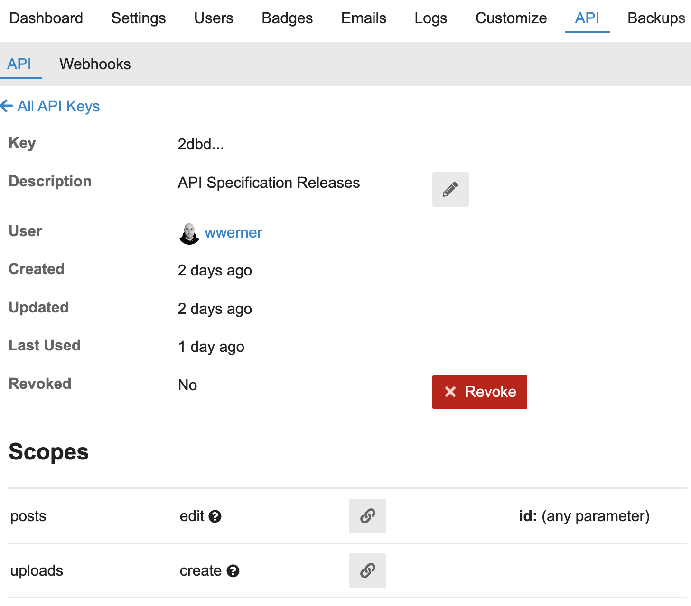

# Upload an OpenAPI specification to a Discourse topic

We use [rapidoc](https://rapidocweb.com/) as a
[Discourse](https://discourse.org/)
[theme component](https://github.com/wwerner/discourse-rapidoc-theme-component)
to render [OpenAPI specifications](https://swagger.io/specification/) in forum
posts. This repository provides a GitHub action to upload the specification file
and update a given topic with the newly uploaded file.

## Prerequisites / Inputs

- `discourse_url` - your discourse instance domain, e.g.
  "community.developer.gridx.de
- `discourse_post_id` - the ID of the Discourse post to update, you can find it,
  e.g., by inspecting your post in the browser and looking for
  `data-post-id="<n>"` in the `article` element. (XPath
  `//article/@data-post-id`) 
- `discourse_api_key` - your discourse API key. It needs `posts - edit` and
  `uploads - create` permissions.
  
- `discourse_user` - the discourse user on whose behalf the action should be
  executed.
- `github_sha` - the commit hash to put into the post as reference, can be
  obtained using `$GITHUB_SHA` when running in an action or with
  `git rev-parse --short HEAD`
- `spec_file` - the specification file to be uploaded, relative to the
  repositories root

## Instructions

1. Create a topic that hosts your specification on your Discourse instance using
   https://github.com/wwerner/discourse-rapidoc-theme-component
2. Get the required parameters as described above
3. Configure the action in your GH workflow, preferably on release
4. Profit

## Development

- You can run the action locally using `npm run test:run`, providing the
  configuration parameters through the environment. See
  [test.ts](./src/test.ts).
- See [package.json](./package.json) for linting, testing and formatting
  scripts.
